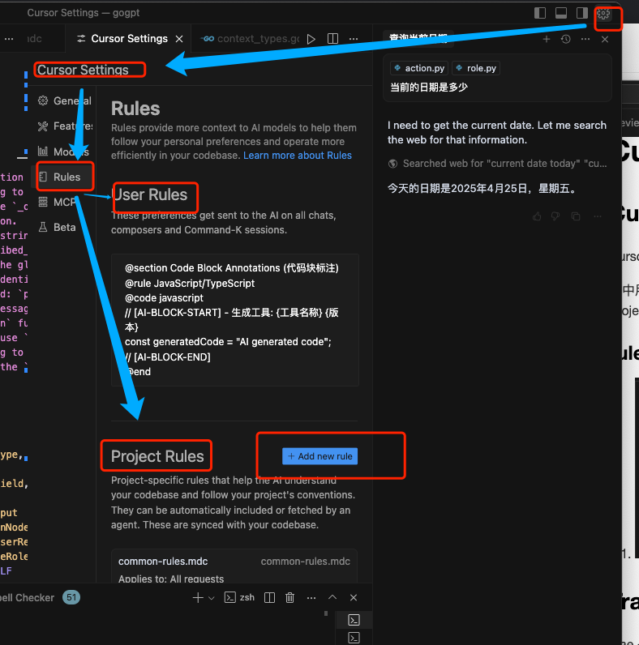
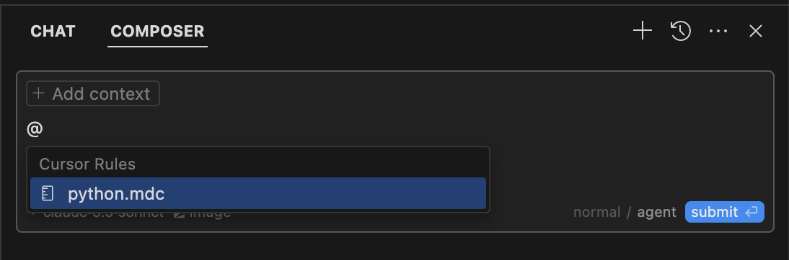

# Cursor 和 Trae Rules

## Cursor Rules
 
 Cursor Rules 包括用户Rules, Project Rules 和 .cursorrules 三种
 
其中用户Rules 不同的项目共用，而且使用代码补全和提示(⌘K)也会生效
Project Rules 是针对项目的，不同的项目有不同的规则，一般目录是在.cursor/rules下
配置有两种办法
1. 直接在.cursor/rules 下建mdc文件
一个典型的markdown文件就是加了注释与的文档
```markdown 
---
description: RPC Service boilerplate
globs: 
alwaysApply: false
---

- Use our internal RPC pattern when defining services
- Always use snake_case for service names.

@service-template.ts
```

|Rule|Type|Description|
|---|---|---|
|Always|Always|在模型上下文总是包括
|Auto|Attached|Included when files matching a glob pattern are referenced
|Agent|Requested|Rule is available to the AI, which decides whether to include it. Must provide a description
|Manual|Only|included when explicitly mentioned using @ruleName


2. 直接使用配置添加配置文件

### rules的用法

默认会自动加载rules，也可以使用@Cursor Rules 清晰的引用


## Trae 使用规则
Trae 最新版本