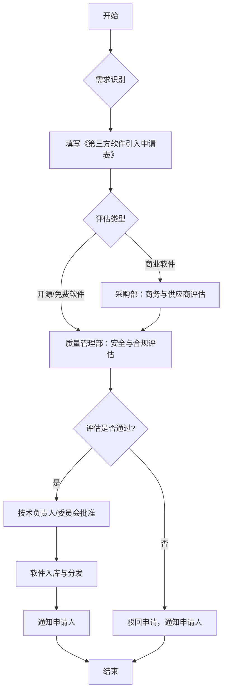
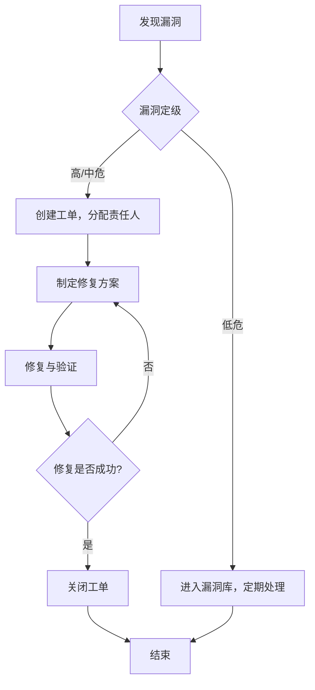

# 软件安全开发实施细则

**基于《安全开发管理规范》**

## 目录

- [第一章 总则](#第一章-总则)
- [第二章 管理组织](#第二章-管理组织)
- [第三章 软件引入管理](#第三章-软件引入管理)
- [第四章 生命周期管理](#第四章-生命周期管理)
- [第五章 许可证合规管理](#第五章-许可证合规管理)
- [第六章 代码隔离与纯净性管理](#第六章-代码隔离与纯净性管理)
- [第七章 安全检测与漏洞管理](#第七章-安全检测与漏洞管理)
- [第八章 软件清单管理](#第八章-软件清单管理)
- [第九章 备份与档案管理](#第九章-备份与档案管理)
- [第十章 培训与监督](#第十章-培训与监督)
- [第十一章 附则](#第十一章-附则)

---

## 第一章 总则

### 第一条 目的与依据

为规范公司产品研发、系统集成、运营维护等过程中涉及的第三方软件（包括开源软件、商业采购软件、免费软件、软件开发工具包等）的安全管理，确保软件供应链安全，防范知识产权、安全漏洞、合规等风险，**本实施细则依据《安全开发管理规范》制定**，并参考《网络安全法》、《数据安全法》等法律法规和行业标准。

**落地要点**：

| 要点 | 描述 | 负责人 |
| --- | --- | --- |
| **制度文档库** | 收集并维护与软件供应链安全相关的法律法规、行业标准（如OWASP、NIST）及内部规范。 | 质量管理部 |
| **风险案例库** | 收集并分析业界典型的软件供应链安全事故案例（如Log4j、SolarWinds），作为内部培训和风险评估的参考。 | 质量管理部 |
| **合规检查清单** | 基于法律法规和监管要求，制定并定期更新合规自查清单，确保公司实践满足要求。 | 合规部、质量管理部 |
| **意识培训** | 定期组织软件供应链安全意识培训，确保所有相关人员理解制度要求和潜在风险。 | 人力资源部、质量管理部 |

### 第二条 适用范围

本细则适用于公司所有在产品开发、系统集成、运营维护等过程中涉及的第三方软件的引入、使用、管理和退出等全生命周期管理活动。

**软件分类清单**：

| 类别 | 举例 | 管理要点 |
| --- | --- | --- |
| **研发组件类** | `Spring`, `React`, `Jackson`, `go.mod`中的依赖 | 许可证合规、漏洞扫描、版本控制 |
| **开发工具类** | `IntelliJ IDEA`, `Maven`, `Webpack`, `JUnit` | 来源可信、版本统一、安全配置 |
| **运行依赖类** | `Tomcat`, `Redis`, `MySQL`, `CentOS` | 安全基线、漏洞补丁、访问控制 |
| **商业采购类** | `Office`, `Adobe`, 各类SaaS服务 | 合同审查、数据安全、供应商评估 |

### 第三条 管理原则

第三方软件安全管理应遵循以下五大原则：

| 原则 | 详细解释 |
| --- | --- |
| **安全优先，风险可控** | 在功能、便利性与安全发生冲突时，优先考虑安全因素，建立风险评估和控制机制。 |
| **合规使用，权责明确** | 严格遵守法律法规和软件许可证要求，通过RACI矩阵明确各方管理责任。 |
| **全程管控，持续监督** | 覆盖软件从引入到退出的全生命周期，建立持续的监控、审计和评估机制。 |
| **标准统一，分级处理** | 建立全公司统一的管理标准和流程，并根据软件的风险等级进行差异化处理。 |
| **来源可信，过程透明** | 确保所有第三方软件均来自官方或可信渠道，所有管理活动和决策过程公开透明、可追溯。 |

---

## 第二章 管理组织

### 第四条 组织架构与职责

为确保本细则的有效执行，设立以下管理组织，并明确其职责：

| 部门/岗位 | 核心职责 |
| --- | --- |
| **网络安全与数字化领导小组** | - **决策机构**：作为最高决策机构，负责审批第三方软件安全相关的重大策略、标准和处理重大安全事件。 |
| **质量管理部** | - **归口管理**：作为归口管理部门，设立第三方软件安全管理岗位，负责统筹第三方软件的全生命周期管理工作。 |
| **产品研发部** | - **使用主体**：作为使用主体，负责执行第三方软件的引入、使用和退出流程，并承担直接的管理责任。 |
| **测试部门** | - **安全验证**：负责对包含第三方软件的产品进行安全相关的测试验证。 |
| **配置管理部门** | - **版本与制品管理**：负责第三方软件制品的版本控制、备份与归档。 |
| **法务部** | - **合规审查**：负责第三方软件的许可证合规性审查与法律风险评估。 |

### 第五条 RACI矩阵

为了更清晰地定义角色和职责，采用RACI模型进行细化：

| 活动 | 网络安全与数字化领导小组 | 质量管理部 | 产品研发部 | 测试部门 | 配置管理部门 | 法务部 |
| --- | --- | --- | --- | --- | --- | --- |
| **第三方软件引入申请与评估** | A | R | R | C | I | C |
| **许可证合规性审查** | A | C | C | I | I | R |
| **漏洞监控与修复** | A | R | R | C | I | I |
| **软件清单（SBOM）管理** | I | A | R | I | C | I |
| **版本控制与归档** | I | A | C | I | R | I |
| **安全事件应急响应** | A | R | C | C | C | C |
| **制度培训与监督** | I | R | C | C | I | I |

* **R** - Responsible (负责执行)
* **A** - Accountable (批准决策)
* **C** - Consulted (咨询配合)
* **I** - Informed (知情了解)

---

## 第三章 软件引入管理

### 第六条 引入流程

所有第三方软件的引入必须遵循统一的流程，以确保在引入前完成充分的评估和审批。

**流程图**:

### 第七条 引入申请与评估

申请引入第三方软件时，必须填写《第三方软件引入申请表》，并提交至质量管理部进行评估。

**《第三方软件引入申请表》模板**:

| 字段 | 说明 | 示例 |
| --- | --- | --- |
| **软件名称** | 第三方软件的正式名称。 | Apache Log4j Core |
| **软件版本** | 申请引入的具体版本号。 | 2.17.1 |
| **申请部门/项目** | 申请引入的部门和具体项目名称。 | XX产品部 / XX项目 |
| **申请人** | 申请经办人。 | 张三 |
| **申请日期** | 提交申请的日期。 | 2023-10-27 |
| **软件来源** | 软件的官方网站或代码仓库地址。 | `https://logging.apache.org/log4j/2.x/` |
| **用途说明** | 在项目中计划如何使用该软件，解决什么问题。 | 用于应用日志记录。 |
| **许可证类型** | 软件的许可证类型。 | Apache-2.0 |
| **初步评估** | 申请人对该软件的初步安全和合规评估。 | 已知无高危漏洞，许可证兼容。 |

**评估要点**:

| 评估维度 | 检查项 | 评估工具/方法 |
| --- | --- | --- |
| **来源可信度** | - 是否为官方发布？ - 下载渠道是否安全（HTTPS）？ - 是否有完整的校验和（SHA/MD5）？ | 人工核对 |
| **安全漏洞** | - 是否存在已知的CVE漏洞？ - 漏洞的严重程度如何？ - 是否有可用的修复补丁？ | OWASP Dependency-Check, Snyk, Trivy |
| **许可证合规性** | - 许可证类型是否明确？ - 是否与公司政策和产品商业模式兼容？ - 是否有传染性（如GPL）？ | FOSSA, Black Duck, 手动分析 |
| **社区活跃度** | - 项目是否仍在积极维护？ - 最近一次更新是什么时候？ - Issue和PR的响应速度如何？ | 查看GitHub/GitLab仓库 |
| **依赖关系** | - 该软件自身依赖了哪些其他组件？ - 是否存在依赖冲突或循环依赖？ | `mvn dependency:tree`, `npm list` |

## 第四章 生命周期管理

### 第八条 版本管理

对第三方软件的版本进行有效管理，是控制技术债和安全风险的关键。

| 管理要求 | 实施细则 | 负责人 |
| --- | --- | --- |
| **版本选择** | - **优选LTS版本**：对于有长期支持（LTS）版本的软件，应优先选择LTS版本。 - **避免过旧版本**：禁止使用上游已宣布停止维护（EOL）的版本。 - **版本年龄限制**：原则上，引入的软件版本发布时间不应超过1年，存量软件版本不应超过2年。 | 产品研发部 |
| **版本升级** | - **定期审查**：每季度对存量软件进行版本审查，识别可升级的组件。 - **安全驱动升级**：当发现高危漏洞且必须通过升级版本才能修复时，应立即启动升级流程。 - **兼容性测试** | 产品研发部、质量管理部 |
| **版本锁定** | - **明确版本号**：在依赖管理文件（如`pom.xml`, `package.json`）中，必须锁定明确的版本号，禁止使用范围依赖（如`^1.2.3`, `1.x`）。 | 产品研发部 |

**版本老化风险评估模板**:

当必须使用超龄版本时，需填写此报告并获得技术委员会批准。

| 评估项 | 内容 |
| --- | --- |
| **软件名称与版本** |  |
| **超龄情况** | 发布时间、已超龄时长 |
| **原因说明** | 为什么必须使用此版本（如业务强依赖、暂无替代方案） |
| **风险分析** | 可能存在的安全漏洞、社区支持、兼容性等风险 |
| **缓解措施** | 用于降低风险的补偿措施（如加强监控、代码加固） |
| **计划升级时间** | 预计何时可以升级到合规版本 |

### 第九条 退出管理

对于不再使用或需要被替换的第三方软件，应执行规范的退出流程。

**退出流程**:

1.  **识别与评估**：识别项目中已不再使用、或有更好替代品的软件。
2.  **制定替换方案**：制定详细的替换计划，包括选定替代软件、评估替换成本和风险。
3.  **代码重构**：修改代码，移除对旧软件的依赖，并替换为新方案。
4.  **测试验证**：进行充分的回归测试，确保替换后功能正常、性能不受影响。
5.  **清理依赖**：从依赖管理文件中彻底移除旧软件的声明。
6.  **更新文档**：更新软件清单（SBOM）和相关技术文档。

---

## 第五章 许可证合规管理

### 第十条 许可证识别与评估

确保所有使用的第三方软件许可证均符合公司政策和法律要求。

| 许可证风险等级 | 类型 | 常见许可证 | 使用要求 |
| --- | --- | --- | --- |
| **低风险（白名单）** | 允许自由使用、修改、分发，商业友好。 | MIT, Apache-2.0, BSD | 遵循简单的声明义务即可。 |
| **中风险（灰名单）** | 修改部分需以相同许可证开源，但通常不影响其他代码。 | LGPL, MPL-2.0 | 需隔离使用，确保未直接静态链接。 |
| **高风险（黑名单）** | 任何引用或依赖该软件的代码，都可能需要以相同许可证开源。 | GPL, AGPL | **原则上禁止在商业闭源产品中使用。** 特殊情况需法务部和技术委员会双重审批。 |

### 第十一条 合规义务履行

根据许可证要求，履行相应的法律义务。

| 义务类型 | 实施细则 |
| --- | --- |
| **声明与归属（Attribution）** | - 在产品的UI界面（如“关于”页面）、文档或分发包中，提供第三方软件的名称、版本、许可证文本。 |
| **源代码提供** | - 对于使用了GPL/LGPL等许可证的组件，需建立机制，按要求向用户提供相应部分的源代码。 |
| **禁止商业用途** | - 对于有“非商业使用”限制的软件，严禁用于任何商业产品或服务中。 |

---

## 第六章 代码隔离与纯净性管理

### 第十二条 内部仓库管理

建立统一的内部中央仓库（如Nexus, Artifactory），作为公司唯一的、可信的第三方软件来源。

**仓库管理策略**:

| 仓库类型 | 用途 | 访问策略 |
| --- | --- | --- |
| **远程代理仓库** | 代理外部官方仓库（如Maven Central, npmjs.org），并缓存已下载的组件。 | 只允许内部CI/CD服务器和受信任的开发环境访问。 |
| **私有宿主仓库** | 存储公司自研的、以及经过审批和安全扫描的第三方组件。 | 所有项目应优先从此仓库拉取依赖。 |
| **虚拟仓库** | 聚合远程代理仓库和私有宿主仓库，为开发人员提供统一的访问入口。 | 开发人员的构建工具应配置此虚拟仓库地址。 |

### 第十三条 代码隔离

确保第三方软件代码与自研代码在物理或逻辑上保持隔离，防止许可证污染和安全风险扩散。

**隔离措施**:

- **模块化设计**：将包含高风险许可证（如LGPL）的代码封装在独立的模块或服务中，通过清晰的API进行交互。
- **动态链接**：优先使用动态链接（Dynamic Linking）而非静态链接（Static Linking）来使用弱传染型许可证的库。
- **容器化部署**：利用Docker等容器技术，将不同风险等级的服务部署在隔离的环境中。

## 第七章 安全检测与漏洞管理

### 第十四条 安全检测机制

建立贯穿软件全生命周期的自动化安全检测机制。

| 检测阶段 | 检测技术 | 工具示例 | 集成节点 |
| --- | --- | --- | --- |
| **开发阶段** | IDE插件实时扫描 | Snyk IDE Plugin, SonarLint | 开发人员本地IDE |
| **构建阶段** | 软件成分分析 (SCA) | OWASP Dependency-Check, Trivy | CI/CD流水线（Jenkins, GitLab CI） |
| **构建阶段** | 静态应用安全测试 (SAST) | SonarQube, Checkmarx | CI/CD流水线 |
| **测试阶段** | 动态应用安全测试 (DAST) | OWASP ZAP, Burp Suite | 自动化测试环境 |
| **运行阶段** | 容器镜像扫描 | Trivy, Clair | 容器镜像仓库（Harbor） |
| **运行阶段** | 运行时安全监控 | Falco, Wazuh | 生产环境/Kubernetes集群 |

### 第十五条 漏洞管理流程

建立闭环的漏洞管理流程，确保所有发现的漏洞都得到有效跟踪和处理。

**流程图**:

**漏洞风险等级定义**:

| 等级 | CVSS v3评分 | 处理时限 | 描述 |
| --- | --- | --- | --- |
| **严重** | 9.0 - 10.0 | 7天 | 立即响应，7天内修复 |
| **高危** | 7.0 - 8.9 | 30天 | 30天内修复 |
| **中危** | 4.0 - 6.9 | 90天 | 90天内修复 |
| **低危** | 0.1 - 3.9 | 酌情处理 | 酌情处理或下个大版本修复 |

---

## 第八章 软件清单管理

### 第十六条 软件物料清单（SBOM）

为所有产品和系统建立和维护准确、完整的软件物料清单（SBOM），以实现软件供应链的透明化管理。

| SBOM管理要求 | 实施细则 |
| --- | --- |
| **生成机制** | - 在CI/CD流水线中集成自动化SBOM生成工具。 - 确保每次构建或发布时，都能生成最新的SBOM文件。 |
| **格式标准** | - 统一采用业界标准格式，如SPDX或CycloneDX。 |
| **内容要求** | - 必须包含组件名称、版本、供应商、许可证、依赖关系等关键信息。 |
| **存储与追溯** | - 将生成的SBOM文件与产品版本一同归档，存放在中央制品库或专门的SBOM管理平台。 |

**SBOM生成工具**:

| 语言/生态 | 工具 |
| --- | --- |
| Java | `CycloneDX Maven Plugin` |
| JavaScript | `cyclonedx-npm` |
| Go | `cyclonedx-go` |
| Python | `cyclonedx-python` |
| Docker | `Trivy`, `Syft` |

---

## 第九章 备份与档案管理

### 第十七条 备份策略

对关键的第三方软件及其配置文件进行定期备份，以防数据丢失或仓库故障。

| 备份对象 | 备份频率 | 备份方式 | 存储位置 |
| --- | --- | --- | --- |
| **内部中央仓库** | 每日增量，每周全量 | 仓库自带备份工具或文件系统级备份 | 异地灾备中心 |
| **关键软件配置文件** | 变更后立即备份 | 版本控制系统（Git） | 代码仓库 |
| **SBOM档案** | 每次生成时归档 | 制品库归档 | 制品库、文档管理系统 |

### 第十八条 档案管理

建立第三方软件的档案库，集中管理其相关文档和记录。

**档案内容清单**:

- 引入申请与审批记录
- 安全与合规评估报告
- 许可证文本副本
- 供应商合同（针对商业软件）
- 历次版本的SBOM文件

---

## 第十章 培训与监督

### 第十九条 培训

定期开展第三方软件安全管理培训，提升全员安全意识和技能。

| 培训对象 | 培训内容 | 培训频率 |
| --- | --- | --- |
| **开发人员** | 安全编码规范、漏洞识别与修复、许可证合规基础 | 每年至少一次 |
| **测试人员** | 安全测试方法、漏洞验证技术 | 每年至少一次 |
| **运维人员** | 安全基线配置、应急响应流程 | 每年至少一次 |
| **管理人员** | 法律法规、管理职责、风险决策 | 按需 |

### 第二十条 监督与审计

建立监督机制，确保本细则得到有效执行。

- **定期自查**：各部门每半年进行一次自查，并将结果报备质量管理部。
- **内部审计**：信息安全部每年至少组织一次对第三方软件管理流程的全面审计。
- **绩效考核**：将本细则的执行情况纳入相关部门和人员的绩效考核（KPI）。

---

## 第十一章 附则

### 第二十一条 解释权

本细则由质量管理部负责解释。

### 第二十二条 生效日期

本细则自发布之日起生效。